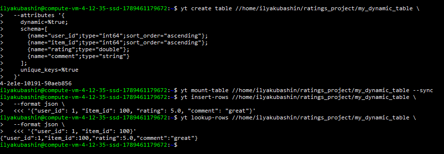
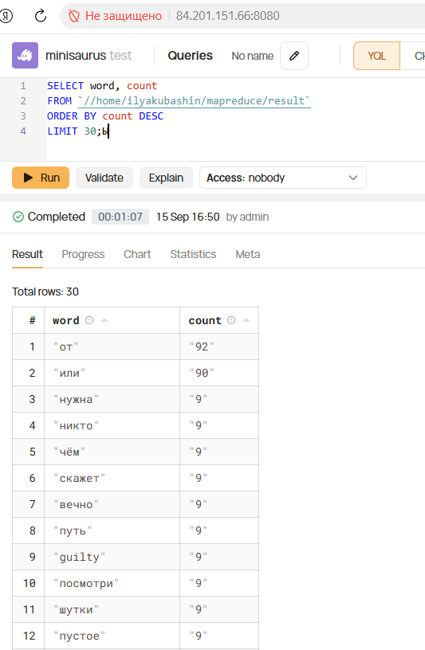
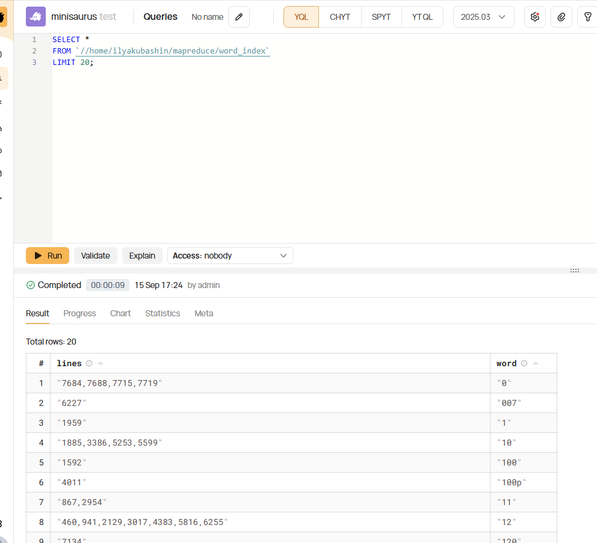
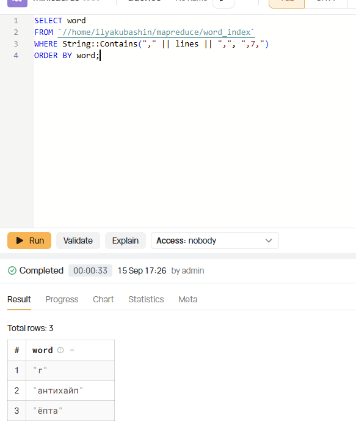

## Кубашин Илья Александрович, просто сюда имя
 

# 1. Инсталяция

    Часть отчета с инсталяцией представлена в отдельном файле -  [`Отчет по части инсталяции`](./YTsaurusCluster.MD)

# 2. Создание таблицы, запись, чтение (CLI)

### Динамическая таблица — CLI-версия

Питон-скрипты писал, но они капризничали с RPC в kind-кластере. Через CLI — получилось сразу.

Скрипты:

- [bash_src/create_table.sh](./bash_src/create_table.sh)
- [bash_src/write_to_table.sh](./bash_src/write_to_table.sh)
- [bash_src/read_table.sh](./bash_src/read_table.sh)

### Схема — составной ключ (user_id, item_id)

```bash
# 1. Создание таблицы
yt create table //home/ilyakubashin/ratings_project/my_dynamic_table \
  --attributes '{
    dynamic=%true;
    schema=[
      {name="user_id";type="int64";sort_order="ascending"};
      {name="item_id";type="int64";sort_order="ascending"};
      {name="rating";type="double"};
      {name="comment";type="string"}
    ];
    unique_keys=%true
  }'

# 2. Монтирование (обязательно для динамических таблиц!)
yt mount-table //home/ilyakubashin/ratings_project/my_dynamic_table --sync

# 3. Вставка строки
yt insert-rows //home/ilyakubashin/ratings_project/my_dynamic_table \
  --format json \
  <<< '{"user_id": 1, "item_id": 100, "rating": 5.0, "comment": "great"}'

# 4. Чтение по ключу
yt lookup-rows //home/ilyakubashin/ratings_project/my_dynamic_table \
  --format json \
  <<< '{"user_id": 1, "item_id": 100}'
```

### Заметки

- `sort_order="ascending"` на ключевых колонках — критично. Без него `unique_keys=true` падает с ошибкой `key columns are not present`.
- `mount-table` - обязательный шаг. Без него таблица создана, но не работает.
- Раньше пробовал через Python-клиент (`insert-rows` / `lookup-rows` через RPC), но в kind-кластере RPC-прокси анонсирует внутренний адрес, несовместимый с port-forward. Поэтому использовал CLI.

### Результат




# 3. Посчитать количество слов в любимом текстовом документе

### Документ

Взял тексты альбома **AntiHype Train** (Zamay & Slava KPSS) — [antihype_train_lyrics.txt](./images_text_src/antihype_train_lyrics.txt)

Парсер, который собирает тексты с Genius: [parse_to_get_text.py](./python_src/parse_to_get_text.py)

### Подготовка данных

Сначала преобразовал plain-text в TSV с колонками `lineno` и `text`, чтобы MapReduce-скрипт мог работать:

```bash
awk '{gsub(/\t/, "\\t"); print "lineno="NR"\ttext="$0}' antihype_train_lyrics.txt > antihype.tsv
```

Таблицы для входа/выхода создавал скриптом: [bash_src/dir_tables_for_word_count.sh](./bash_src/dir_tables_for_word_count.sh)

Данные загрузил через `yt write-table`:

```bash
cat antihype.tsv | yt write-table //home/ilyakubashin/mapreduce/input --format dsv
```

### MapReduce-скрипт

[python_src/map_reduce_count_words.py](./python_src/map_reduce_count_words.py)

Пришлось поправить одну строчку — она была на Python 2 (`print >>sys.stderr, ...`), в Py3 упадёт с `SyntaxError` ещё до запуска:

```python
# было: print >>sys.stderr, "..."
# стало:
print("Please, specify either 'map' or 'reduce' as the first argument", file=sys.stderr)
```

### Запуск

```bash
yt map-reduce \
  --mapper "python3 map_reduce_count_words.py map" \
  --reducer "python3 map_reduce_count_words.py reduce" \
  --map-local-file map_reduce_count_words.py \
  --reduce-local-file map_reduce_count_words.py \
  --src //home/ilyakubashin/mapreduce/input \
  --dst //home/ilyakubashin/mapreduce/result \
  --reduce-by word \
  --format dsv
```

### YQL-запрос

[yql_src/select_word_counts.sql](./yql_src/select_word_counts.sql)

```sql
SELECT word, count
FROM `//home/ilyakubashin/mapreduce/result`
ORDER BY count DESC
LIMIT 30;
```

По ходу дела поигрался с фильтром — хотел глянуть слова подлиннее:

```sql
SELECT word, count
FROM `//home/ilyakubashin/mapreduce/result`
WHERE Unicode::Length(CAST(word AS Utf8)) > 5
ORDER BY count DESC
LIMIT 30;
```

Заметка: `LEN()` в YQL считает **байты**, а не символы. Для русских букв в UTF-8 одна буква = 2 байта. Поэтому `LEN(word) > 5` даёт странный результат на кириллице, а `Unicode::Length` — корректный.

### Результат




# 4. Разработка своей MapReduce-задачи для построения индекса встречающихся слов

Формат выходной таблицы — `(word, [lineno_1, lineno_2, ...])`.

### Идея

По сравнению с Word Count меняется только внутренняя логика:

- **Map**: вместо `{"word": w, "count": 1}` выдаём `{"word": w, "lineno": N}` для каждой строки, где встретилось слово.
- **Reduce**: собираем `set` номеров строк, сортируем, склеиваем через запятую (чтобы хранить в одной колонке типа `string`).

### Скрипт

[python_src/map_reduce_inverted_index.py](./python_src/map_reduce_inverted_index.py)

Ключевые куски:

```python
def do_map(iterable):
    for row in iterable:
        lineno = int(row["lineno"])
        text = row["text"].lower()
        for word in re.findall(r"\w+", text, re.U):
            yield {"word": word, "lineno": lineno}

def do_reduce(iterable):
    for key, group in itertools.groupby(iterable, operator.itemgetter("word")):
        lines = sorted(set(int(row["lineno"]) for row in group))
        yield {"word": key, "lines": ",".join(str(l) for l in lines)}
```

### Создание выходной таблицы

[bash_src/create_table_for_inverted_index.sh](./bash_src/create_table_for_inverted_index.sh)

```bash
yt create table //home/ilyakubashin/mapreduce/word_index \
  --attributes '{schema = [{name = word; type = string}; {name = lines; type = string}]}'
```

### Запуск

```bash
yt map-reduce \
  --mapper "python3 map_reduce_inverted_index.py map" \
  --reducer "python3 map_reduce_inverted_index.py reduce" \
  --map-local-file map_reduce_inverted_index.py \
  --reduce-local-file map_reduce_inverted_index.py \
  --src //home/ilyakubashin/mapreduce/input \
  --dst //home/ilyakubashin/mapreduce/word_index \
  --reduce-by word \
  --format dsv
```

### Что получилось

Таблица вида:

```
word        lines
антихайп    1,4,12,58
двуглавый   1,7,20
...
```


# 5. YQL-запрос по индексу и номеру строки

Нужно по номеру строки (взял **7**) вывести все слова, которые в ней встречаются.

```sql
SELECT word
FROM `//home/ilyakubashin/mapreduce/word_index`
WHERE String::Contains("," || lines || ",", ",7,")
ORDER BY word;
```

### Почему не просто `String::Contains(lines, "7")`

Если у слова список строк `1,17,23`, то подстрока `"7"` там есть, но в строке 7 слова не было. Оборачиваю список в запятые с обеих сторон и ищу `,7,` — так `,17,` и `,70,` не попадут в результат.

### Альтернатива через split + ListHas

```sql
SELECT word
FROM `//home/ilyakubashin/mapreduce/word_index`
WHERE ListHas(
    ListMap(String::SplitToList(lines, ","), ($x) -> { RETURN CAST($x AS Int32); }),
    7
)
ORDER BY word;
```

### Результат



 